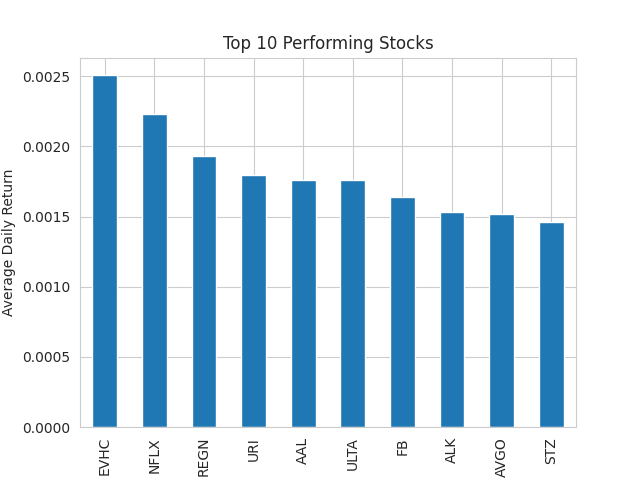

# 📈 Stock Performance & Financial Health Analysis

## Project Overview

This project analyzes historical stock data and financial fundamentals to identify high-performing companies and evaluate financial health using Return on Equity (ROE).

The analysis combines financial metrics with stock market performance to demonstrate how data analytics can support investment decisions.

---

## Dataset

The dataset includes:

• Historical stock prices  
• Corporate financial fundamentals  
• Company security information  

Source: Kaggle financial market dataset.

---

## Tools Used

Python  
Pandas  
Matplotlib  
Google Colab  

---

## Analysis Steps

1. Loaded and cleaned stock price and fundamentals datasets  
2. Calculated daily stock returns  
3. Identified top-performing stocks based on average returns  
4. Calculated financial health metrics (ROE)  
5. Visualized stock performance trends  

---

## Results

### Top Performing Stocks

The chart below shows the top 10 stocks with the highest average daily return.

---

## Key Insight

Companies with strong profitability metrics such as **Return on Equity (ROE)** tend to demonstrate stronger stock performance, highlighting the importance of financial health indicators in investment analysis.

---

## Project Files

stock_analysis.ipynb – full analysis notebook  
top_stock_performance.csv – output dataset  
stock_performance_chart.png – visualization results

---

## Author

Environmental Science MSc (GIS & Remote Sensing) candidate transitioning into **ESG analytics, data science, and FinTech applications**.
